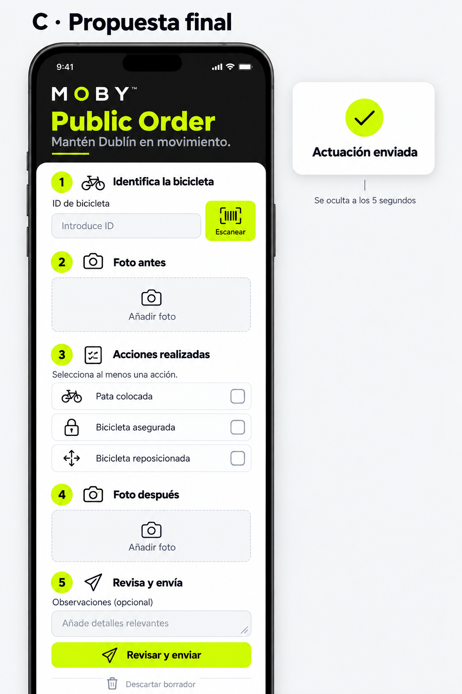

# Public Order — referencia visual aprobada

Decisión de producto: Jersson aprueba la propuesta C final. Implementación: 2026-09-25.

## Alcance

Cabecera oscura con logo vectorial original (proporciones 166:30, blanco y O verde), Public Order verde MOBY #D1FF00 y lema con subrayado verde. Sin banda superior ni texto Operaciones de calle.

Formulario blanco superpuesto y desplazable: 1 identificar bicicleta, 2 foto antes, 3 acciones, 4 foto después, 5 revisión y envío. Cada paso tiene número, icono y encabezado accesible, en español e inglés. Mantener las tres acciones existentes, colores del escáner, validación, vibración, captura, revisión y envío.

El mockup orienta jerarquía, colores y composición. El código conserva los textos operativos, estados deshabilitados y requisitos de envío. La confirmación existente se muestra junto al envío durante 5 segundos; no es un modal bloqueante. Su retirada no modifica el siguiente borrador. El temporizador se limpia al desmontar o cambiar el estado, siguiendo https://react.dev/reference/react/useEffect.

## Implementación

Componente local StepHeading para los cinco encabezados repetidos; no se introduce estado global ni dependencias. Las fotos reutilizan el flujo existente y mantienen su orden temporal: repetir antes invalida después. Sin cambios de servidor, permisos o esquema. La navegación inferior permanece.

La referencia incluye una representación extendida del formulario; en un teléfono real requiere scroll. No sustituye la validación visual en Android.

## Validación manual pendiente

- Revisar tamaños, logo, superposición y scroll en Android en ES/EN y con letra ampliada.
- Escanear QR/barcode y comprobar vibración, ID y error dentro del primer paso.
- Capturar antes/después, seleccionar acciones, revisar y enviar.
- Confirmar que éxito desaparece a los 5 segundos y no borra el siguiente borrador.

## Bandas suaves — 2026-09-27

Propuesta 1 aprobada: los cinco StepHeading reciben fondo verde tenue #F3F9DB,
borde izquierdo verde MOBY de 4 puntos, esquinas de 12 puntos y espacio interior.
Conservan números, iconos oscuros, textos y etiquetas accesibles. El título puede
ocupar varias líneas con fuente ampliada. Cambio exclusivamente de estilos.
Comprobar en Android los cinco pasos en ES/EN y con letra ampliada.
Pruebas existentes de pantalla/envío, TypeScript y lint; validación visual pendiente.
